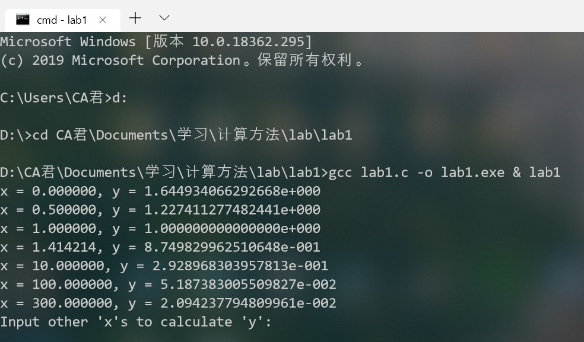

# NA(B) - lab1  <font size=3>`陈昂 PB17061250`</font>

## 思路

注意到是无穷级数求和，直接计算前有限项误差较大，先对特定值求出准确值

易见：
$$
y(1)=\Sigma^{\infin}_{k=1}\frac{1}{k(k+1)}=1-\frac12+...=1
$$

于是：
$$
y(x)=\Sigma^{\infin}_{k=1}\frac{1}{k(k+1)}-y(1)+1\\
=\Sigma^{\infin}_{k=1}\frac{(1-x)}{k(k+1)(k+x)}+1
$$

对上式第一项用有限和替代，下面估计截断误差，设 t-1 为计算的最后一项，则：
$$
|\Sigma^{\infin}_{k=t}\frac{(1-x)}{k(k+1)(k+x)}|\leq |\Sigma^{\infin}_{k=t}\frac{(1-x)}{k^3}|\leq |\Sigma^{\infin}_{k=t}(\frac{(1-x)}{k}\cdot\frac1{(k-1)k})|\\
\leq|\frac{1-x}{t(t-1)}|<10^{-6}
$$
我们可以取如下估计：
$$
t \leq \sqrt{|1-x|\times 10^6}
$$
对于最大的输入 300，t 也不会超过 20000 次，保险起见取 30000 ，将它记为最大计算次数，由此可写出程序

## 程序及结果

C 程序如下：

```c
// @title: lab1.c 
// @author: Chen Ang(PB17061250)
// @description: for Numerical Analysis(B) lab1
//

#include<stdio.h>
#include<math.h>
#define MAX_COUNT 30000

void calc(double x) {
    double y = 0;
    int i = 0;
    for (i = 1; i < MAX_COUNT; i++) {
        y += 1 / (i * (i + 1) * (i + x));
    }
    y = 1 + y * (1 - x);
    printf("x = %lf, y = %.15e\n", x, y);
}

int main() {
    double x;
    x = 0.0;
    calc(x);
    x = 0.5;
    calc(x);
    x = 1.0;
    calc(x);
    x = sqrt(2);
    calc(x);
    x = 10.0;
    calc(x);
    x = 100.0;
    calc(x);
    x = 300.0;
    calc(x);

    printf("Input other \'x\'s to calculate \'y\':\n");
    while(1) {
        scanf("%lf", &x);
        calc(x);
    }
    return 0;
}
```

输出结果如下图：



```
x = 0.000000, y = 1.644934066292668e+000
x = 0.500000, y = 1.227411277482441e+000                   
x = 1.000000, y = 1.000000000000000e+000                   
x = 1.414214, y = 8.749829962510648e-001                   
x = 10.000000, y = 2.928968303957813e-001                 
x = 100.000000, y = 5.187383005509827e-002                 
x = 300.000000, y = 2.094237794809961e-002 
```

下面使用 MATLAB 对结果进行检验：

输入：


```matlab
syms k
syms dy

x=0
dy=1/(k*(k+x))
y=symsum(dy,k,1,inf)
fprintf("%.15f",eval(y))

x=0.5
dy=1/(k*(k+x))
y=symsum(dy,k,1,inf)
fprintf("%.15f",eval(y))

x=sqrt(2)
dy=1/(k*(k+x))
y=symsum(dy,k,1,inf)
fprintf("%.15f",eval(y))

x=10
dy=1/(k*(k+x))
y=symsum(dy,k,1,inf)
fprintf("%.15f",eval(y))

x=100
dy=1/(k*(k+x))
y=symsum(dy,k,1,inf)
fprintf("%.15f",eval(y))

x=300
dy=1/(k*(k+x))
y=symsum(dy,k,1,inf)
fprintf("%.15f",eval(y))
```

对应的输出结果

```matlab
y =
 
pi^2/6
 
1.644934066848226

y =
 
4 - 4*log(2)
 
1.227411277760219

y =
 
(eulergamma*2^(1/2))/2 + (2^(1/2)*psi(2^(1/2) + 1))/2
 
0.874982996020950

y =
 
7381/25200
 
0.292896825396825

y =
 
14466636279520351160221518043104131447711/278881500918849908658135235741249214227200
 
0.051873775176396
```

可以看出，C 程序输出的结果符合题目要求